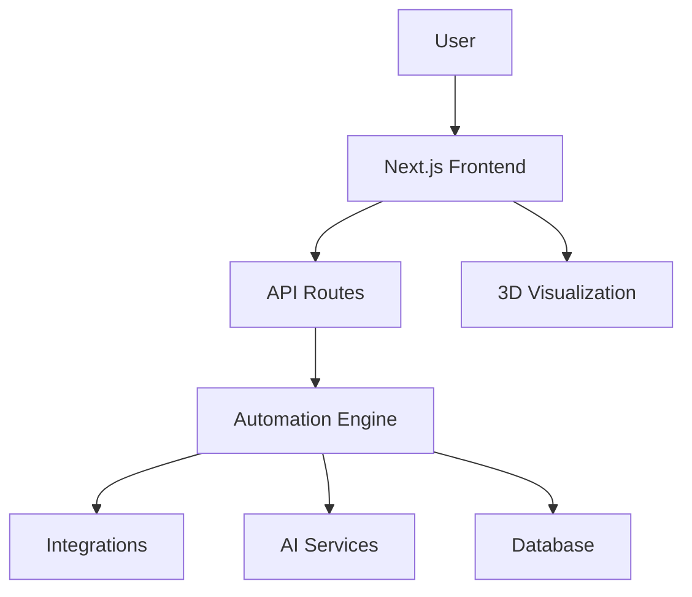
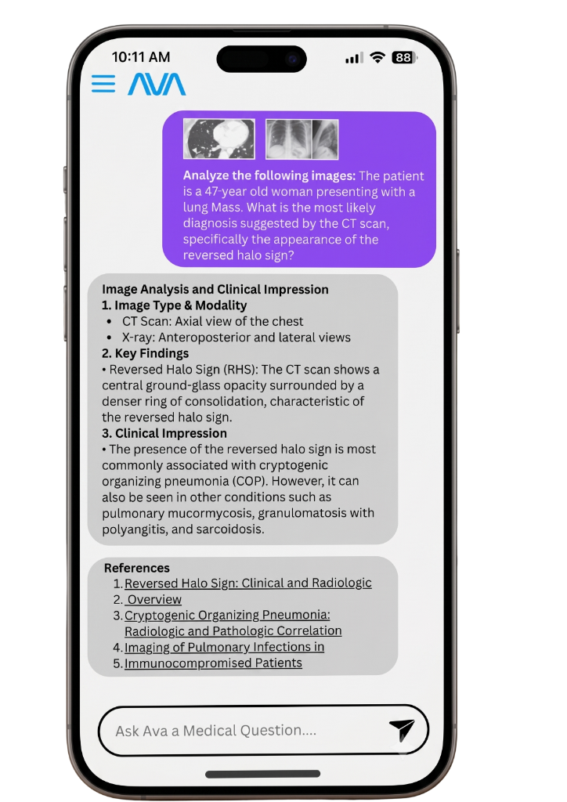

# WeAutomate — Enterprise-Grade Automation, Reimagined

     

> **WeAutomate** is a high-performance, interactive automation platform that turns complex workflows into seamless, intelligent processes — built for modern enterprises.

## 🌟 Why This Exists

Manual workflows are slow, error-prone, and expensive. WeAutomate empowers teams to automate repetitive tasks, integrate AI-driven decision-making, and scale operations without sacrificing control or visibility. Whether you're in healthcare, retail, or ad-tech, WeAutomate reduces operational overhead by up to 70% and accelerates time-to-market.

## ✨ Key Features

- **🚀 Next-Gen Automation Engine** — Orchestrate complex workflows with a visual, drag-and-drop interface.
- **🤖 AI-Powered Insights** — Leverage built-in AI to predict bottlenecks and optimize processes in real time.
- **🔌 Seamless Integrations** — Connect with 100+ tools (CRM, ERP, APIs) via pre-built connectors.
- **🛡️ Enterprise-Grade Security** — SOC 2 compliant, with role-based access control and audit logs.
- **📊 Real-Time Analytics** — Monitor performance with live dashboards and custom reports.
- **🌐 Global Scalability** — Deploy on-prem, cloud, or hybrid with auto-scaling.
- **🎨 Immersive 3D Visualizations** — Interactive 3D scenes (powered by Three.js) for data exploration.

## 🛠️ Tech Stack & Architecture

| Layer | Technology |
|-------|------------|
| **Frontend** | Next.js 16, React 19, TypeScript 5, Tailwind CSS 4 |
| **3D & Animations** | Three.js, React Three Fiber, Drei, Framer Motion |
| **Backend** | Next.js API Routes (Node.js) |
| **Database** | PostgreSQL (via Prisma) — *planned* |
| **Deployment** | Vercel, Docker |

**Architecture Overview:**



## 📦 Quickstart & Installation

Get started in minutes:

```bash
# Clone the repository
git clone https://github.com/erfanhassan/weautomate.git

# Navigate to the project directory
cd weautomate

# Install dependencies
npm install

# Start the development server
npm run dev
```

Open [http://localhost:3000](http://localhost:3000) to see the app.

### Production Build

```bash
npm run build
npm start
```

## 📸 Visual Proof




## 🤝 Contributing & Community

We welcome contributions! Please read our [Contributing Guidelines](CONTRIBUTING.md) and our [Code of Conduct](CODE_OF_CONDUCT.md).

- **Issues**: Use our [Bug Report](.github/ISSUE_TEMPLATE/bug_report.md) and [Feature Request](.github/ISSUE_TEMPLATE/feature_request.md) templates.
- **Pull Requests**: Check out our [PR Template](.github/PULL_REQUEST_TEMPLATE.md).

Join the community to shape the future of automation!

## 📄 License

This project is licensed under the MIT License — see the [LICENSE](LICENSE) file for details.

---

**Star ⭐ this repo** if you find it useful! Your support helps us grow and improve.